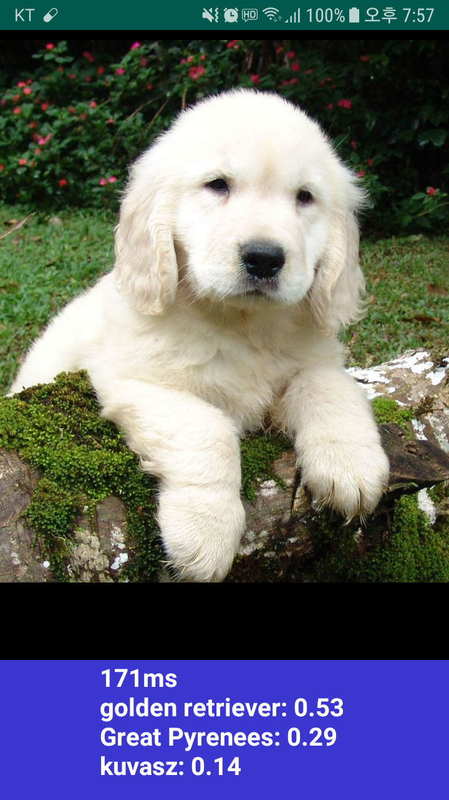

# Tensorflow-Lite-Image-Classification-Example

This project is a simplified project that reduces the complexity of [tensorflow-for-poets-2](https://github.com/googlecodelabs/tensorflow-for-poets-2).

The official documentation for tensorflow-lite provides good demo code
like [tensorflow-for-poets-2](https://github.com/googlecodelabs/tensorflow-for-poets-2).
However, the above project has difficulty in learning how to use tensorflow-lite
because the code using camera api is complicated.
To reduce this complexity, this project deletes the camera part and outputs only the image classification result for still image.

