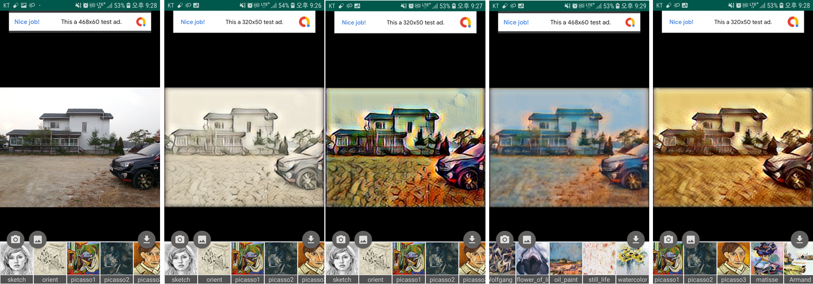

# Style Transfer Android App

Android application source code of Arbitrary Style Transfer using Tensorflow Mobile. This project includes both python code and Android code for creating a style transfer Android app.

 

## Usage android code

The source code for the Android application is in the ```project-root/Android``` directory. Please open and run the project through Android Studio. I can not run it on the Android emulator due to the problem of tensor flow.

## Usage python code

#### 1. Requirement

* python 3.6
* tensorflow 1.13.1
* opencv 3.4.3.18
* Etc.


I recommend that you create and use an anaconda env that is independent of your project. You can create anaconda env for this project by following these simple steps. This process has been verified on Windows 10 and ubuntu 16.04.

```
$ conda create -n style python=3.6
$ activate style # in linux "source activate style"
(adain) $ pip install tensorflow==1.13.1
(adain) $ pip install opencv-python==3.4.3.18
```

### 2. Run style transfer in python

(working on)

### 3. Apply tensorflow model to Android

(working on)


## Copyright

* See [LICENSE](LICENSE) for details.

